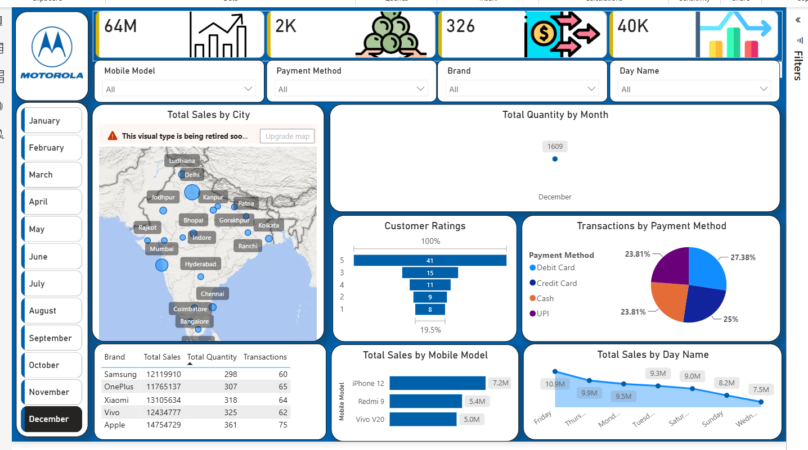

# 📱 Mobile Sales Dashboard — Power BI

An interactive **Mobile Sales Dashboard** built using **Microsoft Power BI** to analyze mobile sales performance across brands, cities, mobile models, payment methods, customer ratings, and time-based dimensions.

The dashboard provides an interactive way to explore sales, quantity, transaction, and customer-related metrics through KPIs, slicers, charts, tables, and geographic visualizations.

---

## 📊 Dashboard Preview



---

## 🎯 Project Objective

The objective of this project is to build an interactive business intelligence dashboard that helps analyze mobile sales data and identify patterns across:

- Mobile brands and models
- Cities
- Payment methods
- Customer ratings
- Days of the week
- Months
- Sales quantity
- Transaction volume

The dashboard is designed to make it easier to explore sales performance and compare different business dimensions interactively.

---

## 📌 Key Features

### 📈 Sales KPIs

The dashboard provides high-level KPI cards for quickly monitoring important sales metrics, including:

- Total Sales
- Total Quantity
- Total Transactions
- Other aggregated sales metrics

These KPIs update based on the applied filters.

---

### 🔎 Interactive Filters

The dashboard includes interactive slicers that allow users to filter the analysis by:

- Mobile Model
- Payment Method
- Brand
- Day Name
- Month

Users can combine multiple filters to analyze specific segments of the dataset.

---

### 🗺️ Sales by City

The geographic visualization displays sales performance across different cities.

This allows users to explore:

- Geographic distribution of sales
- Cities with higher sales activity
- Differences in sales performance across locations

---

### 📱 Sales by Mobile Model

The dashboard compares sales across different mobile models using a bar chart.

This helps identify:

- Top-performing mobile models
- Models contributing significantly to overall sales
- Relative performance between different products

---

### 🏷️ Brand-Level Analysis

The dashboard provides a tabular comparison of mobile brands using metrics such as:

- Total Sales
- Total Quantity
- Transactions

This enables quick comparison of brand-level performance.

---

### 💳 Payment Method Analysis

Transactions are analyzed across different payment methods, including:

- Debit Card
- Credit Card
- Cash
- UPI

A visual breakdown helps understand the distribution of transactions across payment methods.

---

### ⭐ Customer Rating Analysis

Customer ratings are visualized to understand the distribution of ratings across the dataset.

The dashboard allows users to compare the number of transactions associated with different customer rating levels.

---

### 📅 Time-Based Analysis

The dashboard includes time-based analysis using:

- Month
- Day of the week

This helps identify changes in sales and quantity across different time periods.

---

## 📊 Dashboard Components

| Component | Purpose |
|---|---|
| KPI Cards | Display important overall metrics |
| Slicers | Enable interactive filtering |
| Map | Analyze sales geographically |
| Bar Chart | Compare mobile model performance |
| Line Chart | Analyze sales by day |
| Donut Chart | Analyze payment method distribution |
| Funnel Chart | Analyze customer ratings |
| Table | Compare brand-level metrics |

---

## 🛠️ Tools & Technologies

- **Microsoft Power BI**
- **Power BI Visualizations**
- **Interactive Slicers**
- **Data Visualization**
- **Business Intelligence**

---

## 📂 Project Structure

```text
mobile-sales-dashboard-powerbi/
│
├── Mobile-Sales-Dashboard.pbix
│
├── screenshots/
│   └── dashboard.png
│
└── README.md